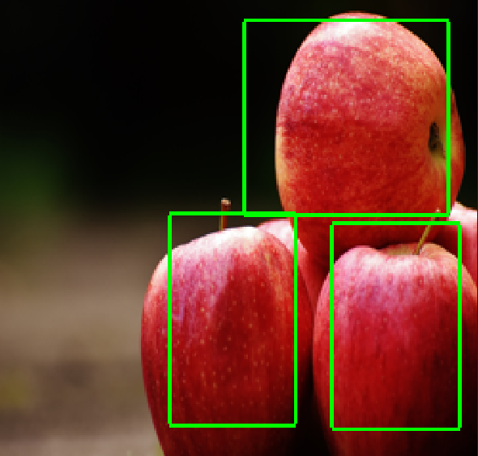
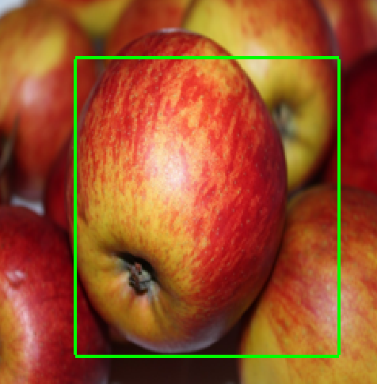

# Object Detection with PyTorch

This repository contains a Python script for object detection using PyTorch. The script utilizes a convolutional neural network (CNN) to predict bounding box coordinates for objects in input images.

## Installation

Before running the script, make sure you have the necessary dependencies installed.

## Usage

1. Clone this repository to your local machine.
2. Run the script and follow the prompts to enter the path of the image you want to analyze.

## Configuration

You can configure parameters in the `object_detection.py` script, such as:
- `image_size`
- `epochs`
- `batch_size`
- `learning_rate`
- `dataset`

## License

This project is licensed under the [Apache 2.0 License](LICENSE).

## Examples

Here are some examples of images with predicted bounding box coordinates:

1.

2.

3.

